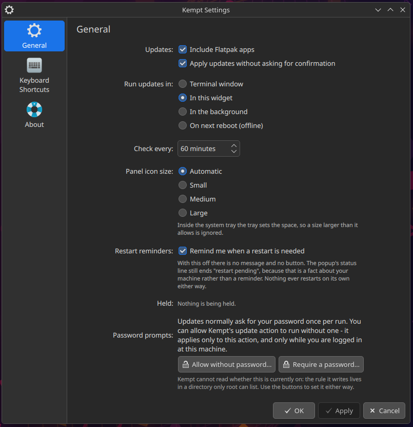

# Kempt

Tidy system updates for the Plasma desktop: a tray widget and a CLI over one engine, for dnf
and Flatpak. Built to grow into a universal Linux updater.

[](https://github.com/erez-c137/kempt/actions/workflows/ci.yml)
[](https://copr.fedorainfracloud.org/coprs/erez-c137/kempt/)
[](https://store.kde.org/p/2370353/)
[](LICENSE)


*Kempt lives in the system tray. Here: 83 updates pending, already staged to install on the
next restart, pins on every row to hold a package back, and the download size in the footer.*

## Install

Needs Fedora with Plasma 6. The widget package brings the command-line half and the root helpers
with it, so this is the whole install:

```bash
sudo dnf copr enable erez-c137/kempt
sudo dnf install kempt-plasmoid
kempt doctor          # verify the install: helpers, polkit action, tools, config, state
```

Two packages, because the command-line half is a complete tool on its own and has no business
pulling a desktop onto a machine that does not have one: `kempt` is the CLI, the root helpers and
the polkit action; `kempt-plasmoid` is the panel widget, and it requires `kempt`. On a box that
already runs Plasma, installing either one gets you both.

Kempt puts itself in your system tray, under **System Services**. It may take a
`plasmashell --replace` or a log-out to appear the first time. To have it on the panel itself
instead, add it from **Add Widgets** and turn the tray entry off; doing both gives you two Kempt
icons. From then on Kempt updates through dnf like everything else it manages, and shows up in its
own popup when it does. What lands where, and how to remove it, is in
[the install guide](docs/install.md#installed-from-the-package).

The widget alone is also on the [KDE Store](https://store.kde.org/p/2370353/) and in Plasma's
own **Get New Widgets** browser - but it needs the CLI, so the package above is the whole
install. Developing, or somewhere the RPM does not reach? See
[the checkout install](#from-a-checkout).

## Why

Keeping a Fedora desktop current means remembering that `dnf5 upgrade` and Flatpak are
separate commands, then reading a wall of transaction output to find out what changed - while
Discover's notifier counts from PackageKit's separate cache, disagrees with the terminal, and
holds the dnf5 lock in the background.

Kempt replaces that with one engine and two faces, built on one rule: an updater should never
make you infer what actually happened. `kempt check` asks the same root metadata cache the
update itself will use, so the pending count and the transaction cannot disagree.
`kempt update` ends with a short summary: every package `old -> new`, how long it took,
whether a restart is owed. The widget carries no package-manager logic at all - its badge is
the number the CLI just wrote, its button runs the same engine - which is why the panel and
the terminal never drift apart, and why everything here works from a terminal whether or not
the widget is on a panel.

## What you get

- **A live pending count.** `kempt check` writes a documented JSON state file: every pending
  item, per backend, with the version you have and the version you would get.
- **Holds that skip but still notify.** `kempt hold dnf:kernel-core` keeps a package off every
  run while it stays visible, so skipping something is never the same as forgetting it.
- **Four ways to run an update.** Terminal with live output, in-popup, silent background, and
  offline staging - which downloads *and arms* the transaction, so any restart installs it,
  and the widget then reports what that restart changed. When session-critical packages are
  pending (kernel, systemd, Qt and friends), Kempt recommends the offline path on its own.
- **The download size before you press the button.** `Checked 4 min ago · ~140 MB` in the
  popup footer, from metadata already on disk - no network, and nothing shown when the number
  is not known.
- **Honest summaries and history.** Old to new versions from before-and-after snapshots, one
  renderer for terminal, notification and popup; a JSON entry plus a raw log per run, pruned
  automatically.
- **An event log that answers "did that land?"** `kempt log`: one line per thing Kempt did,
  each stamped `widget` or `cli`. A refused password prompt reads `authentication declined or
  cancelled`, not a quoted pkexec error.
- **Scoped root privileges.** Separate polkit actions for metadata refresh and apply, two
  argument-validating root helpers, and optional passwordless mode as one rule for the one
  apply action, active local session only.
- **A widget that says what it knows.** No data reads as "no data", never as zero; a failed
  check keeps the last known numbers with the reason in the tooltip; the popup dates its own
  counts and hides its primary action when there is nothing to run.
- **A restart is offered, never performed.** When one is owed, the popup says so and opens
  KDE's own cancellable restart prompt. Skip it and nothing is lost - the updates are on disk.
- **A checkup that says what is wrong.** `kempt doctor`: one line per check, helpers to config
  to state, because everything else here degrades quietly rather than crashing.



*All of it is configurable, and the settings page is a front end to the same plain config file
the CLI reads - every key is documented in [docs/configuration.md](docs/configuration.md).*

## From a checkout

```bash
git clone https://github.com/erez-c137/kempt.git
cd kempt
./install.sh          # one pkexec prompt: root helpers + polkit action, then the panel widget
kempt doctor          # verify the install: helpers, polkit action, tools, config, state
```

`install.sh` symlinks `bin/kempt` into `~/.local/bin`, so **keep the checkout where it is** -
the CLI runs out of it, and only the root helpers, the polkit action and the widget are
copies. If `kempt` is not found afterwards, `~/.local/bin` was not on your `PATH` when this
shell started; log out and back in. Full detail, including the Discover-notifier opt-out and
how to undo everything, is in the [install guide](docs/install.md#from-a-checkout-developers).

## Documentation

| Document | What is in it |
| --- | --- |
| [docs/install.md](docs/install.md) | Both installs end to end: the package (what lands where, the tray default, `dnf remove`) and the checkout (what `install.sh` does, and what it does not), plus passwordless setup and uninstall |
| [docs/usage.md](docs/usage.md) | Every subcommand, its options, its output and its exit codes; and the Plasma widget: what the badge and each icon state mean, where it lives, and what the popup does |
| [docs/configuration.md](docs/configuration.md) | Every config key with type and default, the run surfaces, holds, file locations, retention |
| [docs/architecture.md](docs/architecture.md) | How it is built, why it is bash, the state JSON schema, and how to add a backend for your distro |
| [docs/security.md](docs/security.md) | Exactly what runs as root, why, and what passwordless mode grants |
| [docs/ROADMAP.md](docs/ROADMAP.md) | Where the project is going, in order |
| [docs/RELEASING.md](docs/RELEASING.md) | Cutting a release, and why Kempt never updates itself |
| [docs/man/kempt.1](docs/man/kempt.1) | Man page: `man kempt` once installed |
| [CHANGELOG.md](CHANGELOG.md) | What each release shipped |
| [CONTRIBUTING.md](CONTRIBUTING.md) | Dev setup, the test-harness rules reviews enforce, shell and docs conventions |
| [AGENTS.md](AGENTS.md) | Two-minute orientation for a new maintainer, human or AI: the map, and the four rules that bite |
| [SECURITY.md](SECURITY.md) | How to report a vulnerability privately |
| [CODE_OF_CONDUCT.md](CODE_OF_CONDUCT.md) | Short: be respectful, stay on topic, how to report a problem |

How it is built, and why, is in [docs/architecture.md](docs/architecture.md).

## Contributing

New backends (apt, pacman, zypper) are the most useful thing anyone can add, and the contract
is deliberately small: two required functions plus the pure parser they share, in one file.
There is an open issue per backend to coordinate in -
[apt](https://github.com/erez-c137/kempt/issues/1),
[pacman](https://github.com/erez-c137/kempt/issues/2),
[zypper](https://github.com/erez-c137/kempt/issues/3) - each with the honest scope notes.
Wiring one in also touches the root apply helper, which is a security change and worth an
issue first. Start with
[docs/architecture.md](docs/architecture.md#adding-a-backend-for-your-distro), then
[CONTRIBUTING.md](CONTRIBUTING.md). Security reports go through [SECURITY.md](SECURITY.md),
not the public issue tracker.

## License

MIT - see [LICENSE](LICENSE).
