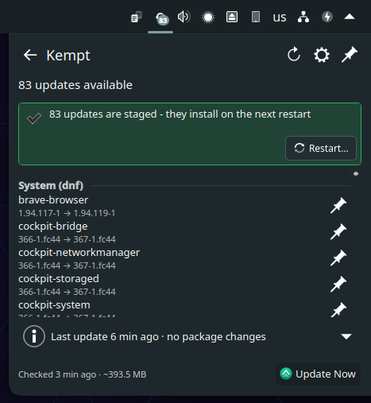

# Kempt

One-click system updates for Fedora: a finished CLI, and a KDE Plasma panel widget over the same engine. Built to grow into a universal Linux updater.

[](https://github.com/erez-c137/kempt/actions/workflows/ci.yml)
[](https://copr.fedorainfracloud.org/coprs/erez-c137/kempt/)
[](LICENSE)



*Kempt lives in the system tray. Here: 83 updates pending, already staged to install on the
next restart, pins on every row to hold a package back, and the download size in the footer.*

## Why

Keeping a Fedora desktop current means remembering to run `dnf5 upgrade`, remembering that
Flatpak apps are a separate command, and then reading a wall of transaction output to find out
what actually changed. Discover's notifier nags about it, disagrees with what the CLI reports,
and holds the dnf5 lock in the background while it does.

Kempt replaces that with one command. It knows what is pending because it asks the same root
metadata cache the update itself will use, so the pending count and the update never disagree.
`kempt update` ends with a short summary: every package `old -> new`, apps updated, how long it
took, whether you need to reboot. Packages you never want touched can be **held** - still
counted, still shown, never updated. And when the pending transaction touches session-critical
packages (kernel, systemd, mesa, Qt/KDE), Kempt recommends Fedora's own answer: stage the
transaction and let it apply during the next reboot, instead of rewriting a running desktop
underneath itself.

The panel widget is the same thing with an icon in front of it. It carries no package-manager
logic at all: the badge is the number `kempt check` just wrote, and its Update Now button is
`kempt run`. That is why the count on the panel and the count in the terminal cannot drift
apart - there is only one engine, and the widget is a client of it. Everything documented here
works from a terminal whether or not the widget is on a panel.

## Features

- **Live pending count.** `kempt check` writes a small JSON state file with everything pending,
  per backend, with the versions you have and the versions you would get.
- **Holds: skip but still notify.** `kempt hold dnf:kernel-core` keeps a package off every
  Kempt run and still reports that an update is waiting. The badge counts only actionable
  (non-held) items, and every run prints `Held (skipped): ...` so a hold is never forgotten.
- **Four run surfaces.** Terminal (live output), in-popup (detached, tails the log), background
  (silent, notifies on completion), and offline staging - the path Fedora recommends, where the
  transaction is applied during the next reboot and harvested into normal history afterwards.
- **Clean summaries.** Old to new versions, grouped System (dnf) and Apps (flatpak), plus
  installs, removals, held items and a reboot verdict. Same renderer for the terminal, the
  notification and the widget popup.
- **Update history.** Every run is a JSON entry plus a full raw log, kept and pruned for you.
- **An event log that answers "did that land?"** `kempt log` prints one line per thing Kempt did,
  each marked `widget` or `cli`: settings changed and what they replaced, holds, checks and their
  counts, runs and how they ended. A run refused at the authentication dialog says
  `authentication declined or cancelled` rather than quoting pkexec at you.
- **Scoped root privileges.** Two polkit actions, two small root helpers that validate every
  argument before running anything. Metadata refresh needs no dialog; applying updates asks
  once per run. Optional passwordless mode is a single polkit rule for the apply action,
  scoped to your active local session - not blanket sudo.
- **A panel widget that says what it knows.** The badge is the actionable count `kempt check`
  just wrote; no data reads as "no data", never as zero. The popup lists pending and held, dates
  its own numbers ("Checked 4 min ago"), shows what the last run installed, pins packages from
  any row, and hides its one primary action when there is nothing to run.
- **It says when a restart is owed, and never performs one.** The popup offers KDE's own
  cancellable restart prompt; Kempt itself never restarts anything, with any setting. Skip the
  button and nothing is lost - the updates are on disk, the restart only makes the running
  system pick them up.
- **A checkup that says what is wrong.** `kempt doctor` reports the helpers, the polkit action,
  your tools, your config file and your state directory, one line per check, because everything
  else here degrades quietly rather than crashing.

## Install

On Fedora, from the [COPR repository](https://copr.fedorainfracloud.org/coprs/erez-c137/kempt/):

```bash
sudo dnf copr enable erez-c137/kempt
sudo dnf install kempt
```

Then add the widget: right-click the panel > Add Widgets > search for Kempt. From then on Kempt
updates through dnf like everything else it manages, and shows up in its own popup when it does.

## Quick start from a checkout

For development, or anywhere the RPM does not reach:

```bash
git clone https://github.com/erez-c137/kempt.git
cd kempt
./install.sh          # one pkexec prompt: root helpers + polkit action, then the panel widget
kempt --version       # which build is this
kempt doctor          # verify the install: helpers, polkit action, tools, config, state
kempt check           # what is pending, as JSON
kempt update          # run it now, ending with a summary
```

`install.sh` symlinks `bin/kempt` into `~/.local/bin`, so **keep the checkout where it is** -
the CLI runs out of it. Only the root helpers and the polkit action are copied out of the repo.
If `kempt` is not found right afterwards, `~/.local/bin` was not on your `PATH` when this shell
started; log out and back in. Full detail, including the Discover-notifier opt-out and how to
undo everything, is in the [install guide](docs/install.md).

## Documentation

| Document | What is in it |
| --- | --- |
| [docs/install.md](docs/install.md) | Requirements, what the installer does, what lands where, passwordless setup, uninstall |
| [docs/usage.md](docs/usage.md) | Every subcommand, its options, its output and its exit codes, plus a typical day |
| [docs/configuration.md](docs/configuration.md) | Every config key with type and default, the run surfaces, holds, file locations, retention |
| [docs/architecture.md](docs/architecture.md) | How it is built, the state JSON schema, and how to add a backend for your distro |
| [docs/security.md](docs/security.md) | Exactly what runs as root, why, and what passwordless mode grants |
| [docs/ROADMAP.md](docs/ROADMAP.md) | Where the project is going, in order |
| [docs/RELEASING.md](docs/RELEASING.md) | Cutting a release, and why Kempt never updates itself |
| [docs/man/kempt.1](docs/man/kempt.1) | Man page: `man kempt` once installed, or `man -l docs/man/kempt.1` from the checkout |
| [CHANGELOG.md](CHANGELOG.md) | Release notes |
| [CONTRIBUTING.md](CONTRIBUTING.md) | Dev setup, the test-harness rules reviews enforce, shell and docs conventions |
| [SECURITY.md](SECURITY.md) | How to report a vulnerability privately, and what is in scope |
| [CODE_OF_CONDUCT.md](CODE_OF_CONDUCT.md) | A short conduct policy: be respectful, stay on topic, and how to report a problem |

Design and background: [the design spec](docs/specs/2026-08-24-kempt-design.md) and the
[prior-art survey](docs/research/2026-08-24-similar-tools-survey.md) that shaped it.

## Contributing

New backends (apt, pacman, zypper) are the most useful thing anyone can add, and the contract
is deliberately small: two required functions plus the pure parser they share, in one file.
Wiring one in also means a new verb in the root apply helper, which is a security change and
worth an issue first. Start with
[docs/architecture.md](docs/architecture.md#adding-a-backend-for-your-distro), then read
[CONTRIBUTING.md](CONTRIBUTING.md) for the dev setup and the test-harness rules that reviews
enforce. Security reports go through [SECURITY.md](SECURITY.md), not the public issue tracker.

## License

MIT - see [LICENSE](LICENSE).
