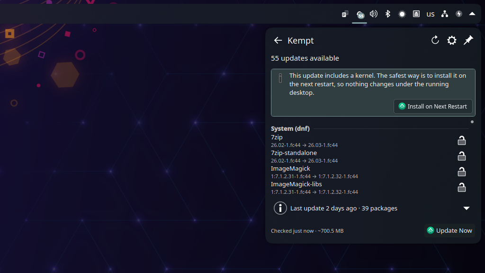
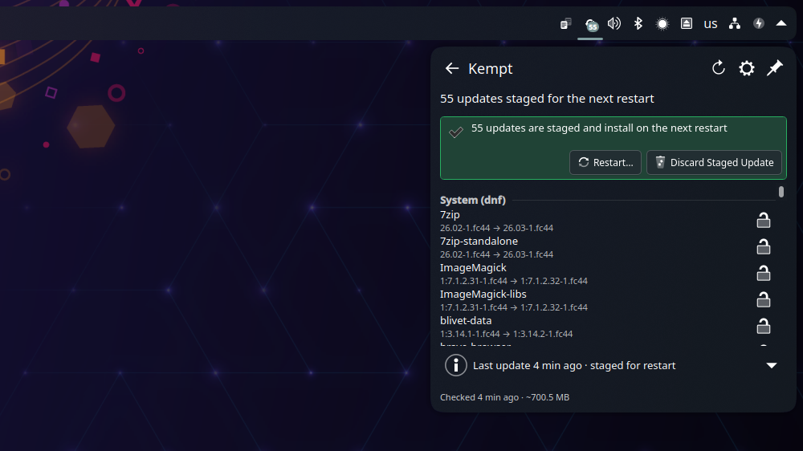

# Kempt

Tidy dnf and Flatpak updates for Fedora KDE, from a tray widget or the command line. Other
distributions are planned.

[](https://github.com/erez-c137/kempt/actions/workflows/ci.yml)
[](https://copr.fedorainfracloud.org/coprs/erez-c137/kempt/)
[](https://store.kde.org/p/2370353/)
[](LICENSE)



*55 updates, with a kernel among them, so Kempt suggests installing on the next restart. The
padlock on each row holds a package back, and the footer shows the download size.*

## Install

Kempt needs Fedora with Plasma 6.

```bash
sudo dnf copr enable erez-c137/kempt
sudo dnf install kempt-plasmoid
kempt doctor          # checks the helpers, polkit, config and state
```

This installs the widget, the command-line tool and its helpers. Kempt appears in the system tray
under **System Services**. The first time, it can take a log-out, or `plasmashell --replace`, to
show up. To have it on the panel instead, add it from **Add Widgets** and turn off the tray entry.

From then on, dnf updates Kempt like any other package. The
[install guide](docs/install.md#installed-from-the-package) lists what goes where and how to remove
it.

On a machine without a desktop, `sudo dnf install kempt` installs only the command-line tool. The
widget is also on the [KDE Store](https://store.kde.org/p/2370353/), but it needs that tool, so
install the package above.

On Silverblue, Kinoite, Bazzite and other image-based editions, Kempt can check for updates and
hold packages. It cannot install updates there yet, and tells you which tool to use instead.

## Why Kempt

On Fedora, dnf and Flatpak update separately, and each prints a long transaction to read through.
Discover's notifier counts from PackageKit's own cache, so its number can differ from what dnf will
install. Its background work can also hold the dnf lock.

Kempt checks the same cache the update uses, so the count in the tray is what that cache offers.
Updates published since that check can still join the update. dnf fetches new lists once its
copy passes the repository's age limit, six hours for Fedora's updates, and Flatpak always asks.
Every update ends with a summary: each package's old and new version, how long it took, and
whether to restart. The widget runs the same commands you can run in a terminal, so the two always
agree.

Kempt is a desktop tool. It checks for updates on its own, but installs them only when you say
so. For servers and unattended machines, Fedora's `dnf5-automatic` is the better fit.

## Features

- **Pending updates at a glance.** The badge counts dnf packages and Flatpak apps. The widget lists
  each one with the version you have and the version you would get.
- **Flatpak runtimes too.** Updating an app can also update the runtime it runs on. Kempt lists
  runtimes in their own section, so the count matches what changes.
- **Space back from old runtimes.** Old Flatpak runtimes stay on disk after apps move on. Kempt
  shows how much space the unused ones take and removes them when you agree, or after each update.
- **Holds.** A held package stays out of updates but stays in the list, so you do not forget it.
  Click its padlock, or run `kempt hold dnf:kernel-core`.
- **Four ways to update.** In a terminal with live output, in the widget, silently in the
  background, or staged to install on the next restart. When the kernel, systemd, Qt or graphics
  drivers have updates, Kempt suggests the restart option. `kempt unstage` or the widget takes a
  staged update back.
- **The download size up front.** The widget's footer shows it before you start, from data already on
  disk.
- **A summary of every run.** Each package with its old and new version, plus the full log.
  Updates installed during a restart get a summary too.
- **A log of what Kempt did.** `kempt log` has one line per action.
- **Limited root access.** Two small helper scripts do the work that needs root, through polkit.
  You can allow updates without a password, for the active local session only.
- **You choose when to restart.** When an update needs one, Kempt opens KDE's restart prompt, which
  you can cancel.
- **A self-check.** `kempt doctor` checks the install one line at a time.
- **Security alerts, if you want them.** One notification per new set of security updates, off by
  default. Kempt can also turn off Discover's notifier, so you see one count.



*After staging, the widget says what installs on the next restart. Restart when you are ready, or
discard the staged update and keep working.*


*The settings page edits the same config file the command line reads.
[docs/configuration.md](docs/configuration.md) lists every setting.*

## From a checkout

```bash
git clone https://github.com/erez-c137/kempt.git
cd kempt
./install.sh          # one password prompt: the root helpers and polkit action, then the widget
kempt doctor
```

`install.sh` links `bin/kempt` into `~/.local/bin`, so keep the checkout where it is. If `kempt` is
not found afterwards, log out and back in. The
[install guide](docs/install.md#from-a-checkout-developers) covers the details and how to undo it.

## Documentation

| Document | What is in it |
| --- | --- |
| [docs/install.md](docs/install.md) | Installing from the package or a checkout, passwordless updates, and removing Kempt |
| [docs/widget.md](docs/widget.md) | What the panel widget shows, and what each message, button and setting does |
| [docs/usage.md](docs/usage.md) | Every command with its options, output and exit codes |
| [docs/configuration.md](docs/configuration.md) | Every setting with its default, holds, and where Kempt keeps its files |
| [docs/architecture.md](docs/architecture.md) | How Kempt is built, the state file format, and how to add a package manager |
| [docs/security.md](docs/security.md) | What runs as root, and what passwordless updates allow |
| [docs/ROADMAP.md](docs/ROADMAP.md) | Where the project is going, in order |
| [docs/RELEASING.md](docs/RELEASING.md) | How a release is made |
| [docs/man/kempt.1](docs/man/kempt.1) | Man page: `man kempt` once installed |
| [CHANGELOG.md](CHANGELOG.md) | What each release shipped |
| [CONTRIBUTING.md](CONTRIBUTING.md) | Setting up, testing, and the code and writing conventions |
| [AGENTS.md](AGENTS.md) | A two-minute orientation for new contributors: the map, and four rules that catch people out |
| [SECURITY.md](SECURITY.md) | How to report a vulnerability privately |
| [CODE_OF_CONDUCT.md](CODE_OF_CONDUCT.md) | Be respectful, stay on topic, and how to report a problem |

## Contributing

Kempt goes deep on Fedora first (see the [roadmap](docs/ROADMAP.md)). Support for more package
managers is still welcome. Each has an open issue:
[apt](https://github.com/erez-c137/kempt/issues/1),
[pacman](https://github.com/erez-c137/kempt/issues/2) and
[zypper](https://github.com/erez-c137/kempt/issues/3). A backend is one file with two required
functions and a parser. Adding one also changes the root helper, so open an issue first.

Start with [adding a backend](docs/architecture.md#adding-a-backend-for-your-distro), then read
[CONTRIBUTING.md](CONTRIBUTING.md). Report security problems through [SECURITY.md](SECURITY.md),
not the public issue tracker.

## License

MIT. See [LICENSE](LICENSE).
