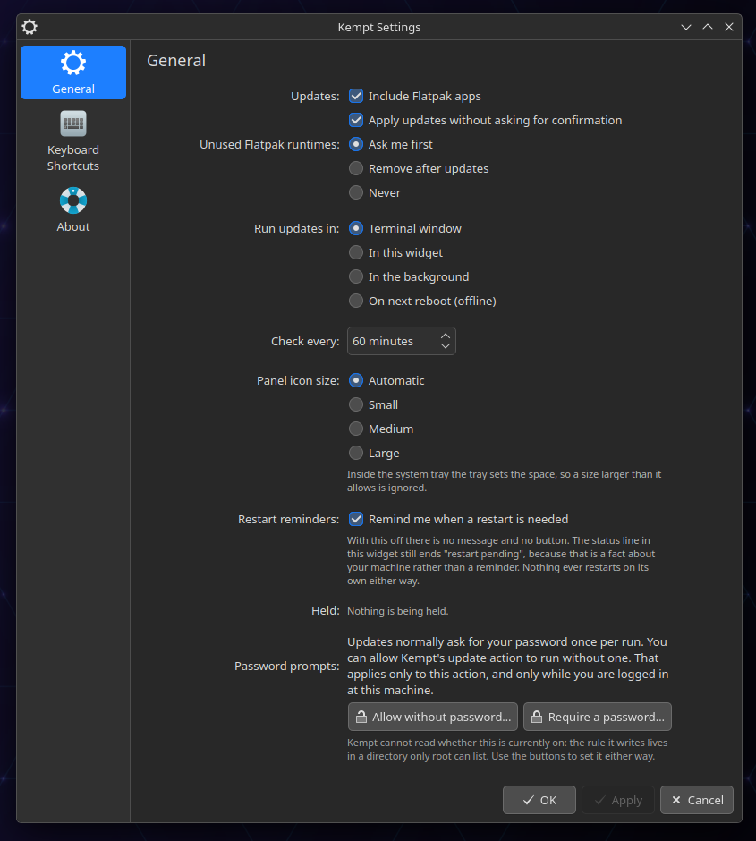

# Configuring Kempt



*Most controls on the widget's settings page set one of the keys below. **Held**, **Discover** and
**Password prompts** run commands instead. A change made in either place shows up in the other.*

## The config file

`~/.config/kempt/config`, plain `key=value`, one per line:

```
include_flatpak=true
auto_accept=true
surface=popup
```

It is created the first time something writes to it. Use `kempt config` to read and write it. The
widget's settings page does the same and keeps no copy of its own:

```bash
kempt config get surface
kempt config set surface offline
```

You can also edit the file by hand. If a key appears twice, the last line wins.

The widget checks the file every 30 seconds, so a change made anywhere reaches the panel within
half a minute.

## Keys

| Key | Type | Default | Effect |
| --- | --- | --- | --- |
| `include_flatpak` | boolean | `true` | Include Flatpak apps **and runtimes** in checks and updates. `kempt update --no-flatpak` turns it off for one run. When off, the `flatpak` backend reports `enabled: false` and adds nothing to the counts. |
| `auto_accept` | boolean | `true` | Answer dnf5 and flatpak prompts automatically (`-y`). When off, the run always uses the `terminal` surface with live output, because no other surface can answer a prompt. |
| `surface` | `terminal`, `popup`, `background`, `offline` | `popup` | Where `kempt run` sends the update. An unrecognised value logs a warning and falls back to `terminal`. An older install keeps `terminal`: see [Upgrading](#upgrading-from-an-older-kempt). |
| `refresh_interval_min` | integer (minutes) | `60` | How often the widget runs `kempt check`. The CLI itself schedules nothing. The widget clamps the value to 1..1440. Its settings page offers 15 and up, and lowers that floor to show a smaller value set from the CLI. |
| `widget_icon_size` | `auto`, `small`, `medium`, `large` | `auto` | The size of the widget's panel icon. `auto` matches the system tray: 22 px on panels from 22 to 47 px thick, and 48 or 64 px on a thick or HiDPI panel. `small`, `medium` and `large` are 16, 22 and 32 px, but `large` is never smaller than `auto`. A size the panel cannot fit falls back to `auto`, so inside the system tray the tray's size wins. The widget validates this key: an unrecognised value means `auto`. |
| `restart_reminder` | boolean | `true` | Whether the widget offers a restart when one is needed. When on, it shows a message with a **Restart…** button that opens KDE's restart prompt; closing the message hides it until the next Plasma session. When off, there is no message or button, and the status line ends `restart pending` when a restart is needed. Nothing restarts on its own either way. |
| `notify_security` | boolean | `false` | Whether a check also asks dnf which pending system updates fix a security advisory, from the local cache. Each new set gets one desktop notification, and the widget marks those rows **Security**. Flatpak apps publish no security notices, so they never count. A hold or release runs a check, so it can notify too. Discover's own notifier also announces security updates. |
| `reclaim` | `ask`, `automatic`, `off` | `ask` | What to do with Flatpak runtimes no installed app uses. See [Unused Flatpak runtimes](#unused-flatpak-runtimes). |
| `risky_regex` | POSIX extended regex | `^(kernel\|systemd\|glibc\|dbus\|mesa\|qt6\|kf6\|plasma-workspace\|kwin)` | Which package names count as session-critical. This drives the advice to install on the next restart and `risky_pending`. |

You can store other keys too. Any key matching `^[a-z][a-z0-9_]+$` is accepted, but nothing reads
it. `kempt config get` on a key with no value and no default prints an empty line.

`kempt config set` warns when it does not recognise a key, or a value outside the set a key
accepts:

```bash
kempt config set surfce terminal
```

```
warning: unknown setting 'surfce'. Kempt does not read it. Known settings: include_flatpak, auto_accept, surface, refresh_interval_min, widget_icon_size, restart_reminder, risky_regex, reclaim, notify_security
```

```bash
kempt config set surface bogus
```

```
warning: 'bogus' is not a value surface accepts. Accepted: terminal, popup, background, offline
```

The warning goes to stderr. The value is still written and the command still exits 0, because a
newer widget or Kempt may read a key this version does not know. Booleans and `widget_icon_size`
get no warning. `kempt hold` and `kempt unhold` print nothing on success.

`risky_regex` is matched against dnf package names only. Build and documentation packages never
count as session-critical, whatever the pattern says: names with a `-devel`, `-headers`, `-static`,
`-tools` or `-doc` part, or containing `-macros`. The running session never loads them.

### Booleans

A value is true when it is `true`, `1` or `yes`, in any case. **Everything else is false**,
including `on`, `enabled` and `y`:

```bash
kempt config set auto_accept on    # accepted, and means OFF
kempt config set auto_accept true  # what you meant
```

### Unused Flatpak runtimes

The `reclaim` key decides what happens to Flatpak runtimes no installed app uses.
[`kempt reclaim`](usage.md#reclaim) has the details of what is removed.

- **`ask`** shows them and removes them when you agree.
- **`automatic`** removes them after each successful update, once they have been unused for an
  hour.
- **`off`** hides them, and `kempt reclaim` removes nothing.

An unrecognised value means `ask`. `automatic` also acts as `ask` on an image-based system, and
when more than one person may use the machine, because Flatpak cannot see other users' own apps.
Kempt treats the machine as shared when any of these is true:

- There is a second login account.
- Accounts come from a network directory such as LDAP or Active Directory. SSSD and Samba count
  only when they are set up to use one.
- Another home folder has Flatpak data.

## Run surfaces

All four run the same `kempt update`. The surface decides where the output goes and who is told
when it finishes.

| Surface | What it does | Good for |
| --- | --- | --- |
| `terminal` | `kempt run` opens Konsole running the update, with live dnf and flatpak output, ending in the summary and a "Press any key to close…" prompt. | Watching it happen. The only surface that can answer prompts. |
| `popup` (default) | Detached run writing to the log. The widget follows the log and shows the summary when it finishes. From a shell it behaves like a detached run with a notification at the end. | Staying in the panel. |
| `background` | Silent detached run, with a desktop notification and the counts when done. | Updating while you work. |
| `offline` | Stages the dnf transaction with `dnf5 upgrade --offline`. It installs during the next reboot, and the first `kempt check` after that reboot records the result. The widget's button reads **Install on Next Restart**. | Kernel, systemd, Qt/KDE: anything that can break a running desktop. |

The `terminal` surface needs a terminal emulator, `konsole` by default. Without one, `kempt run`
exits 4. To use another emulator that supports `-e`, set `KEMPT_TERMINAL`.

Only the terminal can ask before installing kernel, systemd or desktop updates. On the other
surfaces, **Update Now** asks in the widget first, and offers **Install on Next Restart** or
**Install Now**.

### Upgrading from an older Kempt

Before 0.1.8 the default was `terminal`. An install that has run Kempt before, and whose config
file names no surface, keeps `terminal`. The first `kempt` command after the upgrade writes
`surface=terminal`, once. `--help`, `--version` and `discover-notifier status` do not count. A
config file that names a surface is never changed.

When Kempt wrote that line, the widget offers once to run updates itself: **Use This Widget**
or **Keep the Terminal Window**. Any change to the `surface` setting answers the offer, including
an edit by hand.

### Offline staging

Kempt recommends this path when session-critical packages are pending. Flatpak apps still update
**live** in the same run, because Flatpak has no restart install.

The first `kempt check` after the restart records the result in `kempt history` as
`restart (staged update installed)`, with a notification. The entry's stored surface is
`offline (applied on reboot)`. A `dnf install` or live run before the restart
is never mistaken for it, because Kempt waits for a new boot session. If dnf5's history cannot say
which transaction ran, the report shows every package change since staging, including other tools'.
[Installing on the next restart](usage.md#installing-on-the-next-restart) has the rest.

## Holds

`~/.config/kempt/holds`, one entry per line, `backend:name`:

```
dnf:kernel-core
flatpak:org.gimp.GIMP
```

Manage them with `kempt hold`, `kempt unhold` and `kempt holds` (see
[usage.md](usage.md#hold-unhold-holds)). Each dnf hold becomes an `--exclude=<name>`. Flatpak holds
make the run update apps one by one, skipping the held ones. Holds apply only to Kempt: a manual
`sudo dnf5 upgrade` ignores this file.

## Refresh cadence

Kempt runs two schedules:

- **Checking** reads the root metadata cache and downloads nothing. `refresh_interval_min`
  (default 60) sets how often the widget does it.
- **Refreshing metadata** downloads. `kempt check` runs `dnf5 makecache --refresh` at most once
  every 3 hours, dnf's own default. It skips the refresh on battery power, or on a connection
  NetworkManager reports as metered.

The time of the last successful refresh is in `~/.local/state/kempt/last_refresh`. Delete it, and
the next check on mains power and an unmetered connection refreshes. Set `KEMPT_SKIP_REFRESH=1` to
turn refreshing off.

`kempt check --refresh` fetches now, ignoring the 3-hour interval. It still skips the fetch on
battery or a metered connection. The widget's **Check for Updates** runs it. When that press gets
no fetch, the widget says why and how old the metadata is.

`kempt check --anyway` fetches now even on battery or a metered connection, for that check only.
The widget's **Download Anyway** button runs it. No setting or automatic check ever does. With
`KEMPT_SKIP_REFRESH` set it still fetches nothing, and says so in one line on stderr.

Skipped refreshes stay visible. Every check writes `metadata_refreshed` to `state.json` once a dnf
refresh has worked, and leaves it out until then. Once the metadata is over 24 hours old, the
widget's footer shows `metadata N days old`, and `kempt doctor` reports it on its own row. A
skipped refresh is also written to the event log, at most once a
day.

## Files and retention

| Path | What |
| --- | --- |
| `~/.config/kempt/config` | Settings |
| `~/.config/kempt/holds` | Holds, one `backend:name` per line |
| `~/.local/state/kempt/state.json` | Latest check result (schema v1, the widget's API) |
| `~/.local/state/kempt/history/<timestamp>.json` | One entry per run |
| `~/.local/state/kempt/logs/<timestamp>.log` | Full raw output of that run |
| `~/.local/state/kempt/events.log` | The event log: one line per thing Kempt did, mode 0600 (`kempt log`) |
| `~/.local/state/kempt/snapshots/` | Before/after package lists used to produce the summary |
| `~/.local/state/kempt/last_refresh` | Timestamp of the last metadata refresh, for the 3-hour interval |
| `~/.local/state/kempt/last_refresh_dnf` | Timestamp of the last dnf metadata refresh that succeeded, for `metadata_refreshed` |
| `~/.local/state/kempt/refresh_dnf_failed` | One line of the latest dnf metadata refresh's error, while it failed, for `backends.dnf.refresh_error` |
| `~/.local/state/kempt/last_refresh_skip` | Timestamp for the once-a-day skipped-refresh line. Separate from `last_refresh`, so logging a skip never delays a fetch |
| `~/.local/state/kempt/offline_staged.json` | Marker for a staged update waiting for the next restart |
| `~/.local/state/kempt/reclaim-sizes.json` | The measured size of each unused Flatpak runtime, reused until the installed set changes |
| `~/.local/state/kempt/surface-migrated` | Empty marker: the [upgrade step](#upgrading-from-an-older-kempt) has run |
| `~/.local/state/kempt/surface-offer` | Empty marker: the widget's one offer is still open |
| `~/.local/state/kempt/reclaim-last.json` | What the last removal of unused runtimes did, with Flatpak's error line if it failed. The next check copies it into `state.json` |
| `~/.local/state/kempt/run-start.*` | One token per `kempt run` launch, deleted by the window it starts. A window that never opens leaves one behind |
| `~/.local/state/kempt/discover-offer-answered` | Empty marker: the Discover notifier offer was answered, so the widget does not ask again |
| `~/.local/state/kempt/discover-entry-written` | The autostart entry Kempt last wrote, so `kempt discover-notifier on` removes only Kempt's own |
| `~/.local/state/kempt/security-seen.json` | The security advisory IDs already announced and already seen in the widget, so each set is announced once. An ID leaves when its package is no longer pending |
| `~/.local/state/kempt/lock`, `check.lock`, `writer.lock`, `stage.lock` | `flock` files, never pruned. [architecture.md](architecture.md#where-kempt-writes) says what each serialises |

File names use a compact timestamp (`20260824T210511`). The `timestamp` field inside each history
entry is a full ISO 8601 string with the offset.

**Modes.** `events.log` and `offline_staged.json` are 0600 from the start, because they name your
holds and your settings' values. `state.json`, `config` and any file rewritten by a removal are
0600 too, because Kempt writes them through a `mktemp` file and a rename. `holds` is created by
`touch`, so it has your umask's mode until the first `kempt unhold` rewrites it.

Retention runs automatically whenever the CLI sets up its directories:

- **History:** the newest 50 entries are kept.
- **Logs:** deleted after 60 days. The history entry outlives its log.
- **The event log:** past 2500 lines, it is cut to the last 2000.
- **Stray temporary files:** deleted after 60 minutes. These are interrupted writes (`.atomic.*`),
  run-start tokens from a window that never opened, and `reclaim-out.*` files from a killed removal.

Nothing else prunes these directories, so back them up if a run's raw log matters to you.

## Environment overrides

For one-off runs, scripts, tests and machines that are not stock Fedora KDE. For everyday use,
prefer the config keys.

| Variable | Default | Effect |
| --- | --- | --- |
| `KEMPT_TERMINAL` | `konsole` | Terminal emulator for the `terminal` surface. |
| `KEMPT_RISKY_RE` | (empty) | Overrides `risky_regex` for this invocation. |
| `KEMPT_NOTIFY` | `notify-send` | Notification command. |
| `KEMPT_RETRY_DELAY` | `10` | Seconds between retries when another tool holds the package lock. |
| `KEMPT_SKIP_REFRESH` | (unset) | Any value disables the metadata refresh. |
| `KEMPT_VIA` | (unset) | `widget` marks an event-log line as coming from the Plasma widget, which sets it on every command it runs. Anything else, including unset, is recorded as `cli`. Read by nothing except the event log. |
| `KEMPT_CONFIG_DIR`, `KEMPT_STATE_DIR` | `~/.config/kempt`, `~/.local/state/kempt` | Move config and state, for example to test against a scratch directory. |

The full list, including the variables the test suite uses, is in
[architecture.md](architecture.md#environment-seams).
